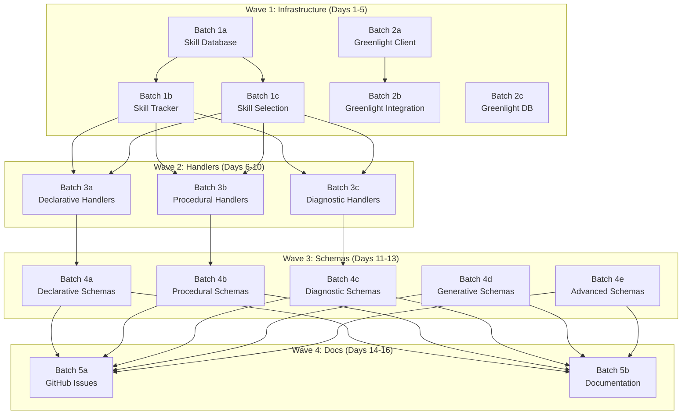

# Parallelization Strategy: Sequential vs Parallel Execution

## TL;DR: Recommended Approach

**🎯 WAVE-BASED PARALLELIZATION (Best Balance)**

Execute in 4 waves with internal parallelization:

1. **Wave 1 (Infrastructure):** Batches 1a, 1b, 1c, 2a, 2b, 2c in parallel → **6 AI coders**
2. **Wave 2 (Handlers):** Batches 3a, 3b, 3c in parallel → **3 AI coders**
3. **Wave 3 (Schemas):** Batches 4a, 4b, 4c, 4d, 4e in parallel → **5 AI coders**
4. **Wave 4 (Docs):** Batches 5a, 5b in parallel → **2 AI coders**

**Total Time:** ~8-12 days (vs 25-36 days sequential)
**Peak Concurrency:** 6 AI coders (Wave 1)

---

## The Three Approaches

### ❌ Option A: Fully Sequential (Slowest, Safest)

**Execution Order:**
```
Batch 1a → Batch 1b → Batch 1c →
Batch 2a → Batch 2b → Batch 2c →
Batch 3a → Batch 3b → Batch 3c →
Batch 4a → Batch 4b → Batch 4c → Batch 4d → Batch 4e →
Batch 5a → Batch 5b
```

**Pros:**
- Zero merge conflicts
- Dependencies always satisfied
- Easy to debug
- Works with 1 AI coder

**Cons:**
- **Very slow:** 25-36 days total
- Underutilizes parallelization infrastructure
- Boring for multiple AI coders

**When to Use:**
- You only have 1 AI coder instance
- Project is small/simple
- Risk tolerance is very low

---

### ⚠️ Option B: Full Parallelization (Fastest, Riskiest)

**Execution:** All 21 subbatches simultaneously

**Pros:**
- **Fastest:** Could complete in 4-6 days
- Maximum utilization of AI coders

**Cons:**
- **High merge conflict risk**
- **Dependency violations** (Batch 3 needs Batch 1 complete!)
- Requires 21 simultaneous AI coder instances
- Hard to coordinate
- May create broken code

**When to Use:**
- You have unlimited AI coder instances
- All dependencies are optional
- You have strong merge conflict resolution tools
- NOT RECOMMENDED for this project

---

### ✅ Option C: Wave-Based Parallelization (Recommended)

**Execution:** Respect critical path dependencies, parallelize within waves

## Wave Structure

### Wave 1: Infrastructure Foundation (Days 1-5)

**Run in Parallel (6 AI coders):**
- Batch 1a: Skill Graph Database
- Batch 1b: Skill Mastery Tracker
- Batch 1c: Skill-Based Atom Selection
- Batch 2a: Greenlight HTTP Client
- Batch 2b: Greenlight SessionManager Integration
- Batch 2c: Greenlight Database Queue

**Dependencies:**
- Batch 1b depends on Batch 1a (tables must exist)
- Batch 1c depends on Batch 1a (tables must exist)
- Batch 2b depends on Batch 2a (client must exist)
- Batch 2c is independent

**Execution Strategy:**
1. Start Batch 1a and Batch 2a, 2c immediately (3 coders)
2. When Batch 1a completes, start Batch 1b and 1c (2 more coders)
3. When Batch 2a completes, start Batch 2b (1 more coder)

**Merge Strategy:**
```bash
# After Wave 1 completes
cd E:\Repo\cortex-cli
git checkout master
git merge batch-1a-skill-database
git merge batch-1b-skill-tracker
git merge batch-1c-skill-selection
git merge batch-2a-greenlight-client
git merge batch-2b-greenlight-integration
git merge batch-2c-greenlight-database
git push
```

**Success Criteria:**
- All Batch 1 subtasks merged
- All Batch 2 subtasks merged
- Skill graph operational
- Greenlight client operational

---

### Wave 2: Atom Handlers (Days 6-10)

**Run in Parallel (3 AI coders):**
- Batch 3a: Declarative Memory Handlers (5 types)
- Batch 3b: Procedural/Sequential Handlers (5 types)
- Batch 3c: Metacognitive/Diagnostic Handlers (5 types)

**Dependencies:**
- ALL Batch 3 subtasks depend on Batch 1 (skill linking)
- Batch 3 subtasks are independent of each other

**Execution Strategy:**
1. Verify Wave 1 complete before starting
2. Launch all 3 batches simultaneously
3. Each AI coder works independently

**Merge Strategy:**
```bash
git checkout master
git merge batch-3a-handlers-declarative
git merge batch-3b-handlers-procedural
git merge batch-3c-handlers-diagnostic
git push
```

**Success Criteria:**
- 15 new atom handlers implemented
- All handlers linked to skills
- Unit tests passing
- Registered in handler registry

---

### Wave 3: JSON Schemas (Days 11-13)

**Run in Parallel (5 AI coders):**
- Batch 4a: Declarative Memory Schemas (12 types)
- Batch 4b: Procedural/Sequential Schemas (11 types)
- Batch 4c: Diagnostic/Reasoning Schemas (9 types)
- Batch 4d: Generative/Creative Schemas (8 types)
- Batch 4e: Advanced/CS-Specific Schemas (60 types)

**Dependencies:**
- Ideally Batch 3 complete (to validate against handlers)
- Can start earlier if needed (schemas don't depend on handlers)

**Execution Strategy:**
1. Launch all 5 batches simultaneously
2. Batch 4e has the most work (60 schemas) - may take longer

**Merge Strategy:**
```bash
git checkout master
git merge batch-4a-schemas-declarative
git merge batch-4b-schemas-procedural
git merge batch-4c-schemas-diagnostic
git merge batch-4d-schemas-generative
git merge batch-4e-schemas-advanced
git push
```

**Success Criteria:**
- 100 JSON Schema files created
- All schemas validate correctly
- AtomValidator class implemented

---

### Wave 4: Documentation & Issues (Days 14-16)

**Run in Parallel (2 AI coders):**
- Batch 5a: GitHub Issues (135 issues)
- Batch 5b: Documentation (6 files)

**Dependencies:**
- Ideally all previous waves complete (for accurate documentation)
- Can start earlier with partial information

**Execution Strategy:**
1. Launch both batches simultaneously
2. Batch 5a creates GitHub issues
3. Batch 5b writes comprehensive docs

**Merge Strategy:**
```bash
git checkout master
git merge batch-5a-github-issues
git merge batch-5b-documentation
git push
```

**Success Criteria:**
- 135 GitHub issues created
- 6 documentation files updated
- README reflects 100+ taxonomy

---

## Dependency Graph Visualization



---

## AI Coder Deployment Plan

### Day 1-5: Wave 1 (6 AI Coders)

| Coder | Batch | Start Condition |
|-------|-------|-----------------|
| AI-1  | Batch 1a | Immediate |
| AI-2  | Batch 2a | Immediate |
| AI-3  | Batch 2c | Immediate |
| AI-4  | Batch 1b | Wait for AI-1 (Batch 1a) to complete |
| AI-5  | Batch 1c | Wait for AI-1 (Batch 1a) to complete |
| AI-6  | Batch 2b | Wait for AI-2 (Batch 2a) to complete |

**Critical Path:** Batch 1a → Batch 1b/1c

### Day 6-10: Wave 2 (3 AI Coders)

| Coder | Batch | Start Condition |
|-------|-------|-----------------|
| AI-1  | Batch 3a | Wave 1 complete |
| AI-2  | Batch 3b | Wave 1 complete |
| AI-3  | Batch 3c | Wave 1 complete |

All can run in parallel.

### Day 11-13: Wave 3 (5 AI Coders)

| Coder | Batch | Start Condition |
|-------|-------|-----------------|
| AI-1  | Batch 4a | Wave 2 complete (ideally) |
| AI-2  | Batch 4b | Wave 2 complete (ideally) |
| AI-3  | Batch 4c | Wave 2 complete (ideally) |
| AI-4  | Batch 4d | Immediate (independent) |
| AI-5  | Batch 4e | Immediate (independent) |

Batch 4d, 4e can start early if needed.

### Day 14-16: Wave 4 (2 AI Coders)

| Coder | Batch | Start Condition |
|-------|-------|-----------------|
| AI-1  | Batch 5a | Wave 3 complete (ideally) |
| AI-2  | Batch 5b | Wave 3 complete (ideally) |

Both can run in parallel.

---

## Monitoring Progress

### Status Dashboard

Create a simple status tracker in `docs/agile/STATUS.md`:

```markdown
# Batch Execution Status

## Wave 1: Infrastructure
- [x] Batch 1a: Skill Database ✅ Complete (2025-12-21)
- [ ] Batch 1b: Skill Tracker 🟡 In Progress (AI-4)
- [ ] Batch 1c: Skill Selection 🔴 Pending
- [x] Batch 2a: Greenlight Client ✅ Complete (2025-12-21)
- [ ] Batch 2b: Greenlight Integration 🟡 In Progress (AI-6)
- [x] Batch 2c: Greenlight Database ✅ Complete (2025-12-21)

## Wave 2: Handlers
- [ ] Batch 3a: Declarative Handlers 🔴 Blocked (waiting for Wave 1)
- [ ] Batch 3b: Procedural Handlers 🔴 Blocked (waiting for Wave 1)
- [ ] Batch 3c: Diagnostic Handlers 🔴 Blocked (waiting for Wave 1)

## Wave 3: Schemas
- [ ] Batch 4a-4e: 🔴 Blocked (waiting for Wave 2)

## Wave 4: Documentation
- [ ] Batch 5a-5b: 🔴 Blocked (waiting for Wave 3)
```

### Daily Sync

End of each day:
1. Update STATUS.md
2. Merge completed batches to master
3. Unblock waiting AI coders
4. Resolve any merge conflicts

---

## Merge Conflict Prevention

### Strategy 1: Non-Overlapping File Assignments

Each batch works on different files:
- Batch 1: `src/db/migrations/`, `data/`, `src/learning/skill_*`
- Batch 2: `src/integrations/`, `src/learning/session_manager.py`
- Batch 3: `src/cortex/atoms/<type>.py`
- Batch 4: `docs/reference/atom-subschemas/`
- Batch 5: `docs/`, `scripts/`

**Conflict Risk:** LOW (different directories)

### Strategy 2: Small, Frequent Merges

Don't wait for entire wave to complete:
```bash
# Merge as soon as individual batch completes
git merge batch-1a-skill-database  # Don't wait for 1b, 1c
```

### Strategy 3: Rebase Strategy

If conflicts occur:
```bash
cd ../cortex-batch-1b-skill-tracker
git fetch origin master
git rebase origin/master
# Resolve conflicts
git push --force-with-lease origin batch-1b-skill-tracker
```

---

## Summary: Which Approach for This Project?

### Answer: **Wave-Based Parallelization**

**Rationale:**
1. **Respects Dependencies:** Batch 3 needs Batch 1 (skill graph)
2. **Maximizes Parallelization:** 6 concurrent AI coders in Wave 1
3. **Manageable Merges:** Small, frequent merges reduce conflicts
4. **3x Speed Improvement:** 12-16 days vs 25-36 days sequential
5. **Realistic:** Doesn't require 21 simultaneous AI coders

**Implementation:**
1. Start with Wave 1 (6 AI coders)
2. Wait for Batch 1a, 1b, 1c to complete before Wave 2
3. Merge frequently (don't batch merges)
4. Monitor STATUS.md daily

---

**Last Updated:** 2025-12-21
**Recommended Approach:** Wave-Based Parallelization
**Expected Completion:** 12-16 days (vs 25-36 sequential)
