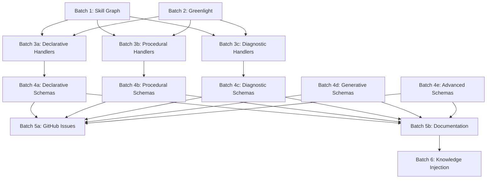

# Agile Work Orders: 100+ Atom Taxonomy Implementation

Purpose: AI-accessible work orders for parallel development across worktrees.

## Overview

This directory contains work orders for implementing the 100+ atom taxonomy across multiple parallel batches:
- 6 infrastructure batches (Wave 1)
- 1 quality/CI batch (Wave 1.5)
- 3 handler batches (Wave 2)
- 5 schema batches (Wave 3)
- 2 documentation/issue batches (Wave 4)
- 1 knowledge injection batch (Wave 5)

## Worktree Structure

| Batch | Branch | Worktree Path | Status |
|-------|--------|---------------|--------|
| 1a: Skill Database | batch-1a-skill-database | ../cortex-batch-1a-skill-database | See docs/agile/status.md |
| 1b: Skill Tracker | batch-1b-skill-tracker | ../cortex-batch-1b-skill-tracker | See docs/agile/status.md |
| 1c: Skill Selection | batch-1c-skill-selection | ../cortex-batch-1c-skill-selection | See docs/agile/status.md |
| 2a: Greenlight Client | batch-2a-greenlight-client | ../cortex-batch-2a-greenlight-client | See docs/agile/status.md |
| 2b: Greenlight Integration | batch-2b-greenlight-integration | ../cortex-batch-2b-greenlight-integration | See docs/agile/status.md |
| 2c: Greenlight Database | batch-2c-greenlight-database | ../cortex-batch-2c-greenlight-database | See docs/agile/status.md |
| 2d: Quality Gates (BDD + CI) | batch-2d-quality-ci | ../cortex-batch-2d-quality-ci | See docs/agile/status.md |
| 3a: Declarative Handlers | batch-3a-handlers-declarative | ../cortex-batch-3a-handlers-declarative | See docs/agile/status.md |
| 3b: Procedural Handlers | batch-3b-handlers-procedural | ../cortex-batch-3b-handlers-procedural | See docs/agile/status.md |
| 3c: Diagnostic Handlers | batch-3c-handlers-diagnostic | ../cortex-batch-3c-handlers-diagnostic | See docs/agile/status.md |
| 4a: Declarative Schemas | batch-4a-schemas-declarative | ../cortex-batch-4a-schemas-declarative | See docs/agile/status.md |
| 4b: Procedural Schemas | batch-4b-schemas-procedural | ../cortex-batch-4b-schemas-procedural | See docs/agile/status.md |
| 4c: Diagnostic Schemas | batch-4c-schemas-diagnostic | ../cortex-batch-4c-schemas-diagnostic | See docs/agile/status.md |
| 4d: Generative Schemas | batch-4d-schemas-generative | ../cortex-batch-4d-schemas-generative | See docs/agile/status.md |
| 4e: Advanced Schemas | batch-4e-schemas-advanced | ../cortex-batch-4e-schemas-advanced | See docs/agile/status.md |
| 5a: GitHub Issues | batch-5a-github-issues | ../cortex-batch-5a-github-issues | See docs/agile/status.md |
| 5b: Documentation | batch-5b-documentation | ../cortex-batch-5b-documentation | See docs/agile/status.md |
| 6: Knowledge Injection | batch-6-knowledge-injection | ../cortex-batch-6-knowledge-injection | See docs/agile/status.md |
| 7: Technical Content Extractor | master (integrated) | ./cortex-cli | COMPLETE |

## Quick Start for AI Coders

Read these first:
- docs/agile/AI_STARTUP_PROMPT_TEMPLATE.md
- docs/agile/PARALLELIZATION_STRATEGY.md

## Workflow for AI Agents

### 1. Pick a Batch

Each batch has a dedicated work order file in this directory.

### 2. Navigate to Worktree

```bash
cd ../cortex-batch-<N>-<name>
```

### 3. Execute Work Order

Follow the checklist in the batch's .md file. Each work order includes:
- Objective
- Dependencies
- Checklist
- Files to create/modify
- Commit strategy
- GitHub issues
- Testing

### 4. Commit and Push

```bash
git add <files>
git commit -m "<type>(batch<N>): <description>"
git push -u origin batch-<N>-<name>
```

Commit types: feat, fix, docs, test, refactor, chore

### 5. Track Progress

Update docs/agile/status.md and the relevant GitHub issue/PR.

## Dependencies Between Batches



## Merge Strategy

Merge as batches complete (recommended):

```bash
cd E:\Repo\cortex-cli
git checkout master
git merge batch-<N>-<name>
git push
```

## Success Metrics

- Atom types implemented: 30+
- Schemas created: 100
- GitHub issues created: 135
- Documentation files updated: 6
- Test coverage: >80% for new handlers
- Validation pass rate: >98% for generated atoms

## Links

- Master Plan: C:\Users\Shadow\.claude\plans\tidy-conjuring-moonbeam.md
- Atom Taxonomy: docs/explanation/learning-atom-taxonomy.md
- Skill Graph Architecture: docs/explanation/skill-graph-architecture.md
- Greenlight Handoff Protocol: docs/explanation/greenlight-integration.md

---

Last Updated: 2025-12-21
Total Batches: 18
Estimated Duration: 12-18 days (with parallel execution)
