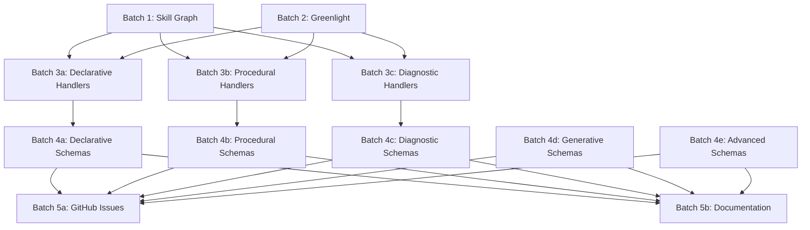

# Agile Work Orders: 100+ Atom Taxonomy Implementation

**Purpose:** AI-accessible work orders for parallel development across 21 git worktrees.

## Overview

This directory contains detailed work orders for implementing the 100+ atom taxonomy across 5 parallel batches, subdivided into 21 independent workstreams for maximum velocity (6 infrastructure, 3 handlers, 5 schemas, 2 docs, plus 5 parent batches).

## Worktree Structure

| Batch | Branch | Worktree Path | Status |
|-------|--------|---------------|--------|
| **1a: Skill Database** | `batch-1a-skill-database` | `../cortex-batch-1a-skill-database` | 🔴 Pending |
| **1b: Skill Tracker** | `batch-1b-skill-tracker` | `../cortex-batch-1b-skill-tracker` | 🔴 Pending |
| **1c: Skill Selection** | `batch-1c-skill-selection` | `../cortex-batch-1c-skill-selection` | 🔴 Pending |
| **2a: Greenlight Client** | `batch-2a-greenlight-client` | `../cortex-batch-2a-greenlight-client` | 🔴 Pending |
| **2b: Greenlight Integration** | `batch-2b-greenlight-integration` | `../cortex-batch-2b-greenlight-integration` | 🔴 Pending |
| **2c: Greenlight Database** | `batch-2c-greenlight-database` | `../cortex-batch-2c-greenlight-database` | 🔴 Pending |
| **3a: Declarative Handlers** | `batch-3a-handlers-declarative` | `../cortex-batch-3a-handlers-declarative` | 🔴 Pending |
| **3b: Procedural Handlers** | `batch-3b-handlers-procedural` | `../cortex-batch-3b-handlers-procedural` | 🔴 Pending |
| **3c: Diagnostic Handlers** | `batch-3c-handlers-diagnostic` | `../cortex-batch-3c-handlers-diagnostic` | 🔴 Pending |
| **4a: Declarative Schemas** | `batch-4a-schemas-declarative` | `../cortex-batch-4a-schemas-declarative` | 🔴 Pending |
| **4b: Procedural Schemas** | `batch-4b-schemas-procedural` | `../cortex-batch-4b-schemas-procedural` | 🔴 Pending |
| **4c: Diagnostic Schemas** | `batch-4c-schemas-diagnostic` | `../cortex-batch-4c-schemas-diagnostic` | 🔴 Pending |
| **4d: Generative Schemas** | `batch-4d-schemas-generative` | `../cortex-batch-4d-schemas-generative` | 🔴 Pending |
| **4e: Advanced Schemas** | `batch-4e-schemas-advanced` | `../cortex-batch-4e-schemas-advanced` | 🔴 Pending |
| **5a: GitHub Issues** | `batch-5a-github-issues` | `../cortex-batch-5a-github-issues` | 🔴 Pending |
| **5b: Documentation** | `batch-5b-documentation` | `../cortex-batch-5b-documentation` | 🔴 Pending |

## Quick Start for AI Coders

**👉 READ THESE FIRST:**
- **AI_STARTUP_PROMPT_TEMPLATE.md** - Copy-paste ready prompts for each batch
- **PARALLELIZATION_STRATEGY.md** - Wave-based execution strategy (12-16 days)

## Workflow for AI Agents

### 1. Pick a Batch

Each batch has a dedicated work order file in this directory:

- `batch-1-skill-graph.md` - Skill graph foundation (infrastructure)
- `batch-2-greenlight.md` - Greenlight integration (runtime handoff)
- `batch-3a-handlers-declarative.md` - 5 declarative memory handlers
- `batch-3b-handlers-procedural.md` - 5 procedural/sequential handlers
- `batch-3c-handlers-diagnostic.md` - 5 metacognitive/diagnostic handlers
- `batch-4a-schemas-declarative.md` - 20 declarative memory schemas
- `batch-4b-schemas-procedural.md` - 20 procedural/sequential schemas
- `batch-4c-schemas-diagnostic.md` - 20 diagnostic/reasoning schemas
- `batch-4d-schemas-generative.md` - 20 generative/creative schemas
- `batch-4e-schemas-advanced.md` - 20 advanced structural schemas
- `batch-5a-github-issues.md` - Create 135 GitHub issues
- `batch-5b-documentation.md` - Update all documentation files

### 2. Navigate to Worktree

```bash
cd ../cortex-batch-<N>-<name>
```

### 3. Execute Work Order

Follow the checklist in the batch's `.md` file. Each work order includes:

- **Objective** - What this batch accomplishes
- **Dependencies** - What must exist before starting
- **Checklist** - Step-by-step tasks with acceptance criteria
- **Files to Create** - Exact file paths and templates
- **Files to Modify** - Exact changes needed
- **Commit Strategy** - How to structure commits
- **GitHub Issues** - Which issues to create/update
- **Testing** - How to validate the work

### 4. Commit and Push

Follow the commit message convention:

```bash
git add <files>
git commit -m "<type>(batch<N>): <description>"
git push -u origin batch-<N>-<name>
```

**Commit Types:**
- `feat` - New feature
- `fix` - Bug fix
- `docs` - Documentation only
- `test` - Adding tests
- `refactor` - Code refactoring
- `chore` - Maintenance

### 5. Create GitHub Issues

For each completed feature, create/update GitHub issues:

```bash
gh issue create \
  --title "[Batch <N>] <Feature Name>" \
  --body "<Description>\n\n**Status:** ✅ Complete" \
  --label "batch-<N>,<area>,enhancement"
```

### 6. Mark Complete

Update the status table above (or use TodoWrite tool if in Claude Code).

## Dependencies Between Batches



**Critical Path:**
1. Batches 1 & 2 must complete first (infrastructure)
2. Batches 3a, 3b, 3c can run in parallel after 1 & 2
3. Batches 4a-4e can run in parallel after 3a-3c
4. Batches 5a & 5b can run in parallel after all schemas complete

## Merge Strategy

**Option 1: Merge as batches complete (Recommended)**

```bash
cd E:\Repo\cortex-cli
git checkout master
git merge batch-<N>-<name>
git push
```

**Option 2: Merge all at once**

Wait until all 15 batches are complete, then merge all at once.

## Conflict Resolution

If merge conflicts occur:

1. Resolve in favor of the **most recent batch** (chronologically)
2. For schema conflicts, **union merge** (keep both)
3. For handler conflicts, **rename and keep both** (e.g., `handler_v1.py`, `handler_v2.py`)
4. Document resolution in commit message

## Success Metrics

Track progress using these metrics:

- **Atom Types Implemented:** Target 30+ (from current 7)
- **Schemas Created:** Target 100
- **GitHub Issues Created:** Target 135
- **Documentation Files Updated:** Target 6
- **Test Coverage:** Target >80% for new handlers
- **Validation Pass Rate:** Target >98% for generated atoms

## Reference Documents

- Master Plan: `C:\Users\Shadow\.claude\plans\tidy-conjuring-moonbeam.md`
- Atom Taxonomy: `docs/reference/atom-taxonomy-v2.md` (to be created)
- Skill Graph Architecture: `docs/explanation/skill-graph-architecture.md` (to be created)
- Greenlight Handoff Protocol: `docs/reference/greenlight-handoff-v2.md` (to be created)

---

**Last Updated:** 2025-12-21
**Total Batches:** 15
**Estimated Duration:** 12 weeks (with parallel execution)
