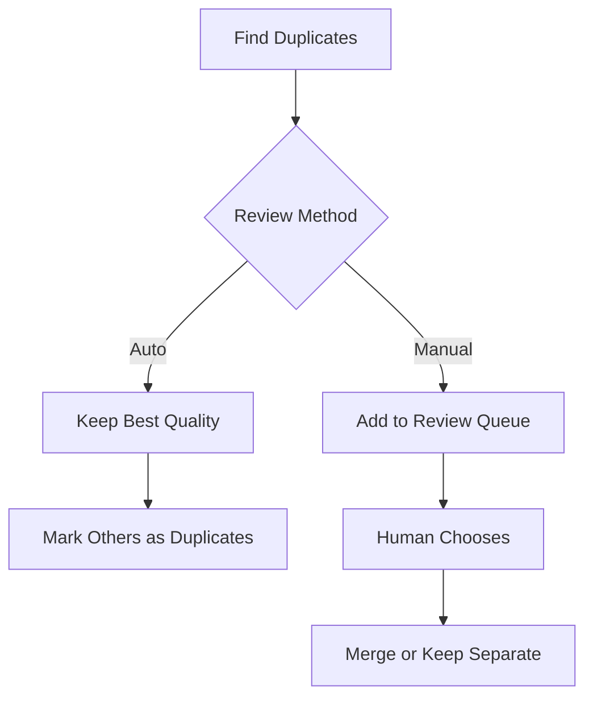
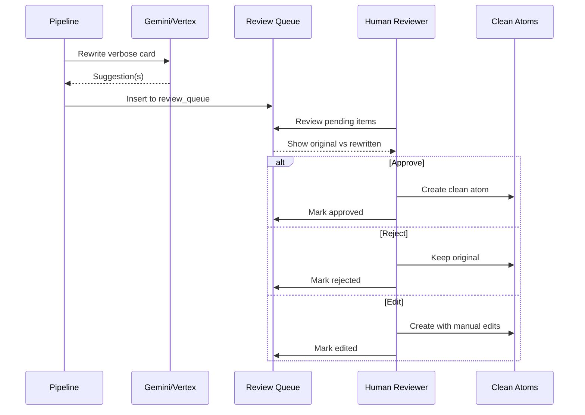

# Cleaning Pipeline Documentation

The cleaning pipeline transforms raw Notion content into high-quality, atomic flashcards optimized for spaced repetition.

## Overview

The pipeline runs between **staging tables** (raw from Notion) and **canonical tables** (clean output):

```
┌─────────────────┐
│  Staging Tables │  ← Raw JSONB from Notion
│  (stg_notion_*) │
└────────┬────────┘
         ↓
    ┌────────────────────┐
    │ CLEANING PIPELINE  │
    │                    │
    │ 1. Atomicity       │ ← Validate card complexity
    │ 2. Duplicates      │ ← Find near-duplicates
    │ 3. Normalization   │ ← Standardize format
    │ 4. AI Rewriting    │ ← Improve verbose cards
    │ 5. Quality Scoring │ ← Compute metrics
    └────────┬───────────┘
         ↓
┌─────────────────┐
│ Canonical Tables│  ← Trusted, clean output
│  (clean_*)      │
└─────────────────┘
         ↓
    ┌────────────┐
    │Review Queue│  ← Human approval for AI-generated
    └────────────┘
```

## Pipeline Stages

### Stage 1: Atomicity Validation

**Purpose**: Ensure flashcards follow the "minimum information principle".

**Evidence base**:
- Wozniak's [20 Rules of Formulating Knowledge](https://www.supermemo.com/en/blog/twenty-rules-of-formulating-knowledge)
- Gwern's [Spaced Repetition research](https://www.gwern.net/Spaced-repetition)
- Cognitive Load Theory (CLT)

**Metrics checked**:

| Metric | Threshold | Status | Rationale |
|--------|-----------|--------|-----------|
| Question length | ≤ 25 words | Error | Complex questions → poor retention |
| Answer optimal | ≤ 5 words | Info | Terse answers → better recall |
| Answer warning | ≤ 15 words | Warning | Verbose answers → consider split |
| Answer max | ≤ 120 chars | Error | CLT: Working memory limit |

**Algorithm**:

```python
def validate_atomicity(front: str, back: str) -> AtomicityResult:
    """
    Validate if a flashcard is atomic (simple, focused).

    Returns:
        AtomicityResult with status and issues
    """
    front_words = len(front.split())
    back_words = len(back.split())
    back_chars = len(back)

    issues = []

    # Check question length
    if front_words > settings.atomicity_front_max_words:
        issues.append(
            f"Question too long ({front_words} words > {settings.atomicity_front_max_words})"
        )

    # Check answer length
    if back_words > settings.atomicity_back_optimal_words:
        if back_words <= settings.atomicity_back_warning_words:
            issues.append(
                f"Answer verbose ({back_words} words, optimal is {settings.atomicity_back_optimal_words})"
            )
        else:
            issues.append(
                f"Answer too long ({back_words} words > {settings.atomicity_back_warning_words})"
            )

    # Check character limit
    if back_chars > settings.atomicity_back_max_chars:
        issues.append(
            f"Answer exceeds character limit ({back_chars} chars > {settings.atomicity_back_max_chars})"
        )

    # Determine status
    if not issues:
        status = "atomic"
    elif any("too long" in issue for issue in issues):
        status = "needs_split"
    else:
        status = "verbose"

    return AtomicityResult(
        status=status,
        is_atomic=(status == "atomic"),
        issues=issues,
        front_word_count=front_words,
        back_word_count=back_words,
    )
```

**Example results**:

```python
# Good (atomic)
validate_atomicity(
    front="What does TCP stand for?",
    back="Transmission Control Protocol"
)
# → status="atomic", is_atomic=True, issues=[]

# Warning (verbose but acceptable)
validate_atomicity(
    front="What is the purpose of TCP?",
    back="TCP provides reliable, ordered delivery of data between applications over a network"
)
# → status="verbose", is_atomic=False, issues=["Answer verbose (13 words, optimal is 5)"]

# Error (needs splitting)
validate_atomicity(
    front="Explain the TCP three-way handshake process and why it's important",
    back="The TCP three-way handshake is a process used to establish a connection..."
)
# → status="needs_split", is_atomic=False, issues=[
#      "Question too long (12 words > 25)",
#      "Answer too long (45 words > 15)"
#    ]
```

**Configuration**:

```bash
# .env
ATOMICITY_FRONT_MAX_WORDS=25
ATOMICITY_BACK_OPTIMAL_WORDS=5
ATOMICITY_BACK_WARNING_WORDS=15
ATOMICITY_BACK_MAX_CHARS=120
ATOMICITY_MODE=relaxed  # or "strict"
```

**Modes**:
- `relaxed`: Warn but allow (mark `is_atomic=false`, continue processing)
- `strict`: Reject cards that fail (send to review queue)

---

### Stage 2: Duplicate Detection

**Purpose**: Find cards that ask the same thing in different ways.

**Methods**:

#### 2.1 Exact Duplicates

Simple string comparison (case-insensitive, normalized whitespace).

```python
def find_exact_duplicates(atoms: list[Atom]) -> list[DuplicateGroup]:
    """Find cards with identical questions."""
    groups = defaultdict(list)

    for atom in atoms:
        # Normalize for comparison
        normalized = atom.front.lower().strip()
        normalized = re.sub(r'\s+', ' ', normalized)
        groups[normalized].append(atom)

    # Return groups with >1 card
    return [
        DuplicateGroup(cards=cards)
        for cards in groups.values()
        if len(cards) > 1
    ]
```

#### 2.2 Fuzzy Matching

Uses [rapidfuzz](https://github.com/maxbachmann/RapidFuzz) for approximate string matching.

```python
from rapidfuzz import fuzz

def find_fuzzy_duplicates(
    atoms: list[Atom],
    threshold: float = 0.85
) -> list[DuplicateGroup]:
    """
    Find similar questions using fuzzy matching.

    Args:
        atoms: List of atoms to check
        threshold: Similarity threshold (0.0-1.0), default 0.85

    Returns:
        Groups of similar cards
    """
    duplicates = []

    for i, atom1 in enumerate(atoms):
        for atom2 in atoms[i+1:]:
            # Compare questions
            similarity = fuzz.ratio(
                atom1.front.lower(),
                atom2.front.lower()
            ) / 100.0

            if similarity >= threshold:
                duplicates.append(
                    DuplicateGroup(
                        cards=[atom1, atom2],
                        similarity=similarity,
                        method="fuzzy"
                    )
                )

    return duplicates
```

**Example**:

```python
# These would match at ~90% similarity
card1 = "What does TCP stand for?"
card2 = "What is the full form of TCP?"

# These would match at ~95% similarity
card3 = "What is the capital of France?"
card4 = "What's the capital city of France?"
```

#### 2.3 Semantic Duplicates (Future)

Uses sentence embeddings to find semantically similar cards.

```python
from sentence_transformers import SentenceTransformer

model = SentenceTransformer('all-MiniLM-L6-v2')

def find_semantic_duplicates(
    atoms: list[Atom],
    threshold: float = 0.90
) -> list[DuplicateGroup]:
    """
    Find semantically similar questions using embeddings.

    Uses cosine similarity on sentence embeddings.
    """
    # Generate embeddings
    questions = [atom.front for atom in atoms]
    embeddings = model.encode(questions)

    # Compute pairwise cosine similarity
    from sklearn.metrics.pairwise import cosine_similarity
    similarities = cosine_similarity(embeddings)

    # Find pairs above threshold
    duplicates = []
    for i in range(len(atoms)):
        for j in range(i+1, len(atoms)):
            if similarities[i][j] >= threshold:
                duplicates.append(
                    DuplicateGroup(
                        cards=[atoms[i], atoms[j]],
                        similarity=similarities[i][j],
                        method="semantic"
                    )
                )

    return duplicates
```

**Example semantic matches**:

```python
# Different words, same meaning (~0.92 similarity)
card1 = "What protocol ensures reliable data delivery?"
card2 = "Which protocol guarantees packet arrival?"
# → Both about TCP's reliability

# Conceptually similar (~0.88 similarity)
card3 = "What is the capital of France?"
card4 = "Name the French capital city."
```

**Duplicate handling workflow**:



**Configuration**:

```bash
# Future API endpoint
POST /api/clean/duplicates
{
  "similarity_threshold": 0.85,
  "method": "fuzzy",  # or "semantic"
  "auto_merge": false
}
```

---

### Stage 3: Prefix Normalization

**Purpose**: Standardize question prefixes for consistency.

**Common patterns**:

| Before | After |
|--------|-------|
| "What's the..." | "What is the..." |
| "What're..." | "What are..." |
| "Explain the..." | "What is the..." |
| "Define..." | "What is..." |
| "Q: What..." | "What..." |

**Algorithm**:

```python
def normalize_prefix(question: str) -> str:
    """
    Standardize question prefixes.

    Returns:
        Normalized question
    """
    # Remove common prefixes
    question = re.sub(r'^Q:\s*', '', question, flags=re.IGNORECASE)
    question = re.sub(r'^Question:\s*', '', question, flags=re.IGNORECASE)

    # Expand contractions
    contractions = {
        r"\bWhat's\b": "What is",
        r"\bWhat're\b": "What are",
        r"\bWho's\b": "Who is",
        r"\bWhere's\b": "Where is",
        r"\bHow's\b": "How is",
    }

    for pattern, replacement in contractions.items():
        question = re.sub(pattern, replacement, question, flags=re.IGNORECASE)

    # Standardize "Explain/Define" → "What is"
    question = re.sub(
        r'^(Explain|Define)\s+(.+)',
        r'What is \2',
        question,
        flags=re.IGNORECASE
    )

    # Capitalize first letter
    question = question[0].upper() + question[1:] if question else question

    # Ensure ends with question mark
    if not question.endswith('?'):
        question += '?'

    return question
```

**Examples**:

```python
normalize_prefix("Q: what's TCP")
# → "What is TCP?"

normalize_prefix("Explain binary search")
# → "What is binary search?"

normalize_prefix("define polymorphism")
# → "What is polymorphism?"
```

---

### Stage 4: AI Rewriting

**Purpose**: Automatically improve verbose or poorly-formatted cards.

**When to use AI**:
- `atomicity_status = "verbose"` (answer 15-25 words)
- `atomicity_status = "needs_split"` (question or answer too long)
- Manual trigger via API

**AI Providers**:
1. **Google Gemini API** (recommended for free tier)
2. **Google Vertex AI** (production, higher quotas)
3. (Future) OpenAI, Anthropic, local models

**Prompt template**:

```python
REWRITE_PROMPT = """
You are an expert at creating high-quality flashcards for spaced repetition learning.

Given this flashcard, rewrite it to be more atomic (simple, focused, easy to recall).

Original:
Question: {front}
Answer: {back}

Guidelines:
1. Question should be ≤25 words, ideally 5-15 words
2. Answer should be ≤15 words, ideally 1-5 words
3. One concept per card (if multiple, suggest splitting)
4. Use clear, direct language
5. Avoid "explain", use specific questions

If the card covers multiple concepts, create multiple cards.

Output format (JSON):
{{
  "cards": [
    {{
      "front": "...",
      "back": "...",
      "reason": "Why this is better"
    }}
  ],
  "confidence": 0.0-1.0
}}
"""
```

**Example AI rewrite**:

```python
# Original (verbose)
front = "What is the TCP three-way handshake and what are the steps involved?"
back = "The TCP three-way handshake is a process to establish a connection. First, the client sends SYN. Then, the server responds with SYN-ACK. Finally, the client sends ACK to complete the connection."

# AI rewrite
{
  "cards": [
    {
      "front": "What initiates a TCP connection?",
      "back": "Three-way handshake (SYN, SYN-ACK, ACK)",
      "reason": "Simplified to core concept"
    },
    {
      "front": "What are the steps in TCP's three-way handshake?",
      "back": "1. Client: SYN, 2. Server: SYN-ACK, 3. Client: ACK",
      "reason": "Focused on sequence"
    }
  ],
  "confidence": 0.91
}
```

**Implementation**:

```python
import google.generativeai as genai

async def rewrite_with_ai(atom: Atom) -> list[RewriteSuggestion]:
    """
    Use AI to rewrite a verbose flashcard.

    Returns:
        List of suggested rewrites (may split into multiple cards)
    """
    # Configure AI
    genai.configure(api_key=settings.gemini_api_key)
    model = genai.GenerativeModel(settings.ai_model)

    # Generate prompt
    prompt = REWRITE_PROMPT.format(
        front=atom.front,
        back=atom.back
    )

    # Call AI
    response = model.generate_content(prompt)
    result = json.loads(response.text)

    # Parse suggestions
    suggestions = []
    for card in result["cards"]:
        suggestions.append(
            RewriteSuggestion(
                front=card["front"],
                back=card["back"],
                reason=card["reason"],
                confidence=result["confidence"],
                original_atom_id=atom.id,
                source="gemini"
            )
        )

    return suggestions
```

**Review queue workflow**:



**Configuration**:

```bash
# .env
GEMINI_API_KEY=your_key_here
AI_MODEL=gemini-2.0-flash

# Or Vertex AI
VERTEX_PROJECT=my-project
VERTEX_LOCATION=us-central1
AI_MODEL=gemini-1.5-pro
```

**API usage**:

```bash
# Trigger AI rewrite for verbose cards
curl -X POST http://localhost:8100/api/clean/ai-rewrite \
  -H "Content-Type: application/json" \
  -d '{
    "filters": {"atomicity_status": "verbose"},
    "limit": 50,
    "auto_approve": false
  }'
```

---

### Stage 5: Quality Scoring

**Purpose**: Compute an overall quality score (0.00-1.00) for each card.

**Factors**:

```python
def compute_quality_score(atom: Atom) -> float:
    """
    Compute quality score (0.00-1.00) based on multiple factors.

    Higher = better quality
    """
    score = 1.0

    # 1. Atomicity (40% weight)
    if atom.atomicity_status == "atomic":
        atomicity_score = 1.0
    elif atom.atomicity_status == "verbose":
        atomicity_score = 0.7
    else:  # needs_split
        atomicity_score = 0.3

    # 2. Answer length (30% weight)
    if atom.back_word_count <= 5:
        length_score = 1.0
    elif atom.back_word_count <= 10:
        length_score = 0.8
    elif atom.back_word_count <= 15:
        length_score = 0.6
    else:
        length_score = 0.3

    # 3. Question clarity (20% weight)
    # Check for clear question words
    clarity_indicators = ["what", "who", "where", "when", "why", "how", "which"]
    has_indicator = any(
        word in atom.front.lower()
        for word in clarity_indicators
    )
    clarity_score = 1.0 if has_indicator else 0.6

    # 4. Formatting (10% weight)
    format_score = 1.0
    if not atom.front.strip().endswith('?'):
        format_score -= 0.3
    if atom.front.startswith('Q:') or atom.front.startswith('Question:'):
        format_score -= 0.2

    # Weighted average
    quality_score = (
        0.40 * atomicity_score +
        0.30 * length_score +
        0.20 * clarity_score +
        0.10 * format_score
    )

    return round(quality_score, 2)
```

**Quality tiers**:

| Score Range | Quality | Action |
|-------------|---------|--------|
| 0.90-1.00 | Excellent | Ready for Anki |
| 0.75-0.89 | Good | Use as-is |
| 0.60-0.74 | Fair | Consider review |
| 0.00-0.59 | Poor | Needs improvement |

**Example**:

```python
# Excellent card (score: 0.98)
Atom(
    front="What does TCP stand for?",
    back="Transmission Control Protocol",
    front_word_count=5,
    back_word_count=3,
    atomicity_status="atomic"
)

# Fair card (score: 0.64)
Atom(
    front="Explain the concept of polymorphism in OOP",
    back="Polymorphism allows objects to take many forms, enabling code reusability",
    front_word_count=7,
    back_word_count=11,
    atomicity_status="verbose"
)
```

---

## Pipeline Execution

### Full Pipeline Run

```python
async def run_cleaning_pipeline():
    """
    Execute the full cleaning pipeline.

    Processes all staging records through:
    1. Atomicity validation
    2. Duplicate detection
    3. Prefix normalization
    4. AI rewriting (if enabled and needed)
    5. Quality scoring
    """
    stats = PipelineStats()

    # 1. Load staging data
    staging_cards = db.query(StgNotionFlashcard).all()

    for stg_card in staging_cards:
        # Extract front/back from JSONB
        front = extract_property(stg_card.raw_properties, "Question")
        back = extract_property(stg_card.raw_properties, "Answer")

        # 2. Atomicity check
        atomicity_result = validate_atomicity(front, back)

        # 3. Normalize prefix
        normalized_front = normalize_prefix(front)

        # 4. Quality score
        quality_score = compute_quality_score(...)

        # 5. Create or update clean atom
        clean_atom = CleanAtom(
            notion_id=stg_card.notion_page_id,
            front=normalized_front,
            back=back,
            is_atomic=atomicity_result.is_atomic,
            atomicity_status=atomicity_result.status,
            front_word_count=atomicity_result.front_word_count,
            back_word_count=atomicity_result.back_word_count,
            quality_score=quality_score,
            needs_review=(quality_score < 0.75),
        )

        # 6. AI rewriting (if needed)
        if settings.has_ai_configured() and atomicity_result.status == "verbose":
            suggestions = await rewrite_with_ai(clean_atom)
            for suggestion in suggestions:
                db.add(ReviewQueueItem(
                    original_atom_id=clean_atom.id,
                    front=suggestion.front,
                    back=suggestion.back,
                    rewrite_reason=suggestion.reason,
                    ai_confidence=suggestion.confidence,
                    source=suggestion.source,
                ))

        db.add(clean_atom)
        stats.processed += 1

    # 7. Duplicate detection
    duplicates = find_fuzzy_duplicates(db.query(CleanAtom).all())
    for dup_group in duplicates:
        # Add to review queue for manual merge decision
        ...

    db.commit()
    return stats
```

### Incremental Pipeline Run

Only process changed items:

```python
async def run_incremental_pipeline(since: datetime):
    """Process only items changed since last run."""
    staging_cards = db.query(StgNotionFlashcard).filter(
        StgNotionFlashcard.last_synced_at > since
    ).all()

    # Run pipeline on these cards only
    ...
```

---

## Monitoring Pipeline Quality

### Pipeline Metrics

```sql
-- Overall quality distribution
SELECT
    CASE
        WHEN quality_score >= 0.90 THEN 'Excellent'
        WHEN quality_score >= 0.75 THEN 'Good'
        WHEN quality_score >= 0.60 THEN 'Fair'
        ELSE 'Poor'
    END as quality_tier,
    COUNT(*) as count,
    ROUND(AVG(quality_score), 2) as avg_score
FROM clean_atoms
GROUP BY quality_tier
ORDER BY avg_score DESC;

-- Atomicity status breakdown
SELECT
    atomicity_status,
    COUNT(*) as count,
    ROUND(AVG(front_word_count), 1) as avg_front_words,
    ROUND(AVG(back_word_count), 1) as avg_back_words
FROM clean_atoms
GROUP BY atomicity_status;

-- Cards needing review
SELECT COUNT(*) as needs_review_count
FROM clean_atoms
WHERE needs_review = true;

-- Review queue backlog
SELECT
    source,
    status,
    COUNT(*) as count
FROM review_queue
GROUP BY source, status;
```

### Quality Trends Over Time

```sql
-- Quality improvement over time (batch comparison)
SELECT
    DATE(created_at) as date,
    COUNT(*) as cards_created,
    ROUND(AVG(quality_score), 2) as avg_quality,
    COUNT(*) FILTER (WHERE is_atomic = true) as atomic_count
FROM clean_atoms
GROUP BY DATE(created_at)
ORDER BY date DESC;
```

---

## Best Practices

### For Content Creators (Notion)

1. **Start atomic**: Write simple questions from the start
2. **One concept per card**: Don't combine multiple ideas
3. **Use clear prefixes**: "What is...", "What does...stand for?"
4. **Keep answers short**: 1-5 words is ideal
5. **Review AI suggestions**: Don't blindly auto-approve

### For Pipeline Configuration

1. **Start relaxed**: Use `ATOMICITY_MODE=relaxed` initially
2. **Review AI output**: Keep `auto_approve=false` until confident
3. **Monitor quality scores**: Track trends over time
4. **Adjust thresholds**: Based on your domain/content
5. **Regular duplicate checks**: Run weekly to catch drift

### For Production Use

1. **Batch AI rewrites**: Don't process all at once (API limits)
2. **Schedule overnight**: Long-running operations
3. **Monitor review queue**: Don't let it grow unbounded
4. **Log everything**: Track pipeline decisions for debugging
5. **A/B test changes**: Compare retention before/after

---

## Troubleshooting

### Pipeline runs but no atoms created

**Check**:
1. Are staging tables populated? `SELECT COUNT(*) FROM stg_notion_flashcards;`
2. Is JSONB extraction working? Check logs for parse errors
3. Are all cards failing atomicity in strict mode?

### AI rewriting errors

**Common issues**:
1. **Rate limits**: Gemini free tier = 60/min
   - Solution: Add delay between requests
2. **JSON parse errors**: AI returned invalid JSON
   - Solution: Better prompt, retry logic
3. **Low confidence scores**: AI unsure about rewrite
   - Solution: Review manually, improve prompt

### Duplicate detection misses obvious duplicates

**Solutions**:
1. Lower similarity threshold (try 0.80 instead of 0.85)
2. Use semantic matching (embeddings) for concept similarity
3. Normalize text before comparison (lowercase, remove punctuation)

### Quality scores seem wrong

**Debug**:
```python
# Print score breakdown for a card
atom = db.query(CleanAtom).first()
score_details = compute_quality_score_detailed(atom)
print(score_details)
# {
#   "atomicity": 0.40 * 1.0 = 0.40,
#   "length": 0.30 * 0.8 = 0.24,
#   "clarity": 0.20 * 1.0 = 0.20,
#   "formatting": 0.10 * 1.0 = 0.10,
#   "total": 0.94
# }
```

---

## Future Enhancements

### Planned Features

1. **Cloze conversion**: Detect list answers → suggest cloze deletions
2. **Image support**: Extract and validate images in cards
3. **Concept linking**: Auto-suggest concept relationships
4. **Retention prediction**: ML model to predict card difficulty
5. **Batch operations**: Bulk approve/reject in review queue

### Research Areas

1. **Optimal thresholds**: Domain-specific atomicity rules
2. **Quality metrics**: Correlation with actual retention
3. **AI prompts**: Iterative improvement based on approvals
4. **Semantic clustering**: Group related cards automatically

---

## References

- [Wozniak: 20 Rules of Formulating Knowledge](https://www.supermemo.com/en/blog/twenty-rules-of-formulating-knowledge)
- [Gwern: Spaced Repetition](https://www.gwern.net/Spaced-repetition)
- [Cognitive Load Theory](https://en.wikipedia.org/wiki/Cognitive_load)
- [RapidFuzz Documentation](https://github.com/maxbachmann/RapidFuzz)
- [Sentence Transformers](https://www.sbert.net/)
- [Google Gemini API](https://ai.google.dev/docs)

---

## Next Steps

- [Configuration Guide](configuration.md) - Adjust pipeline settings
- [API Reference](api-reference.md) - Trigger pipeline via API
- [Database Schema](database-schema.md) - Understand quality metadata
