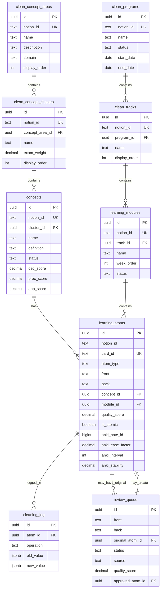

# Database Schema Documentation

Complete reference for all tables, columns, relationships, and views in notion-learning-sync.

## Schema Overview

The database follows a **staging → canonical** pattern with 17 tables organized into 4 layers:

1. **Staging Layer** (7 tables) - Raw JSONB from Notion API
2. **Knowledge Hierarchy** (3 tables) - Concepts and their relationships
3. **Curriculum Structure** (3 tables) - Programs, tracks, modules
4. **Learning Content** (1 table) - Clean flashcards with metadata
5. **Workflow & Audit** (3 tables) - Review queue and logs

## Quick Reference

| Layer | Tables |
|-------|--------|
| Staging | `stg_notion_flashcards`, `stg_notion_concepts`, `stg_notion_concept_areas`, `stg_notion_concept_clusters`, `stg_notion_modules`, `stg_notion_tracks`, `stg_notion_programs` |
| Knowledge | `clean_concept_areas`, `clean_concept_clusters`, `concepts` |
| Curriculum | `clean_programs`, `clean_tracks`, `learning_modules` |
| Content | `learning_atoms` |
| Workflow | `review_queue`, `sync_log`, `cleaning_log` |

**Note**: Tables were renamed for clarity:
- `clean_atoms` -> `learning_atoms`
- `clean_concepts` -> `concepts`
- `clean_modules` -> `learning_modules`

## Staging Tables

All staging tables are **ephemeral** - they can be rebuilt from Notion at any time.

### `stg_notion_flashcards`

Stores raw flashcard data from Notion.

| Column | Type | Constraints | Description |
|--------|------|-------------|-------------|
| `notion_page_id` | TEXT | PRIMARY KEY | Notion's unique page identifier |
| `raw_properties` | JSONB | NOT NULL | Complete Notion properties object |
| `raw_content` | JSONB | | Page blocks (for AI enrichment) |
| `last_synced_at` | TIMESTAMPTZ | DEFAULT now() | Last fetch timestamp |
| `sync_hash` | TEXT | | MD5 hash for change detection |

**Example properties structure**:
```json
{
  "CardID": {"type": "rich_text", "rich_text": [{"plain_text": "NET-M1-001-DEC"}]},
  "Question": {"type": "title", "title": [{"plain_text": "What is TCP?"}]},
  "Answer": {"type": "rich_text", "rich_text": [{"plain_text": "Transmission Control Protocol"}]},
  "Concept": {"type": "relation", "relation": [{"id": "abc123"}]},
  "Module": {"type": "relation", "relation": [{"id": "def456"}]},
  "Status": {"type": "select", "select": {"name": "Active"}}
}
```

**Usage**:
```sql
-- Get flashcards synced in the last hour
SELECT * FROM stg_notion_flashcards
WHERE last_synced_at > now() - interval '1 hour';

-- Query nested properties with JSON operators
SELECT
    notion_page_id,
    raw_properties->'CardID'->'rich_text'->0->>'plain_text' as card_id,
    raw_properties->'Question'->'title'->0->>'plain_text' as question
FROM stg_notion_flashcards;
```

### `stg_notion_concepts`

Stores raw concept/subconcept data.

| Column | Type | Constraints | Description |
|--------|------|-------------|-------------|
| `notion_page_id` | TEXT | PRIMARY KEY | Notion page ID |
| `raw_properties` | JSONB | NOT NULL | Notion properties |
| `parent_type` | TEXT | | 'area', 'cluster', or NULL |
| `parent_notion_id` | TEXT | | Parent's Notion ID |
| `last_synced_at` | TIMESTAMPTZ | DEFAULT now() | Last sync time |

**Parent hierarchy**:
- `parent_type='area'` → Concept directly under a ConceptArea
- `parent_type='cluster'` → Concept under a ConceptCluster
- `parent_type=NULL` → Orphaned concept (not yet assigned)

### `stg_notion_concept_areas`

L0: Top-level knowledge domains.

| Column | Type | Constraints | Description |
|--------|------|-------------|-------------|
| `notion_page_id` | TEXT | PRIMARY KEY | Notion page ID |
| `raw_properties` | JSONB | NOT NULL | Notion properties |
| `last_synced_at` | TIMESTAMPTZ | DEFAULT now() | Last sync time |

**Examples**: "Computer Science", "Mathematics", "Biology"

### `stg_notion_concept_clusters`

L1: Thematic groupings under concept areas.

| Column | Type | Constraints | Description |
|--------|------|-------------|-------------|
| `notion_page_id` | TEXT | PRIMARY KEY | Notion page ID |
| `raw_properties` | JSONB | NOT NULL | Notion properties |
| `parent_area_notion_id` | TEXT | | Parent area's Notion ID |
| `last_synced_at` | TIMESTAMPTZ | DEFAULT now() | Last sync time |

**Examples**: Under "Computer Science" → "Data Structures", "Algorithms", "Networks"

### `stg_notion_modules`

Course week/chapter units.

| Column | Type | Constraints | Description |
|--------|------|-------------|-------------|
| `notion_page_id` | TEXT | PRIMARY KEY | Notion page ID |
| `raw_properties` | JSONB | NOT NULL | Notion properties |
| `last_synced_at` | TIMESTAMPTZ | DEFAULT now() | Last sync time |

### `stg_notion_tracks`

Course-level progressions.

| Column | Type | Constraints | Description |
|--------|------|-------------|-------------|
| `notion_page_id` | TEXT | PRIMARY KEY | Notion page ID |
| `raw_properties` | JSONB | NOT NULL | Notion properties |
| `last_synced_at` | TIMESTAMPTZ | DEFAULT now() | Last sync time |

### `stg_notion_programs`

Top-level learning paths (degrees, certifications).

| Column | Type | Constraints | Description |
|--------|------|-------------|-------------|
| `notion_page_id` | TEXT | PRIMARY KEY | Notion page ID |
| `raw_properties` | JSONB | NOT NULL | Notion properties |
| `last_synced_at` | TIMESTAMPTZ | DEFAULT now() | Last sync time |

## Canonical Tables - Knowledge Hierarchy

Clean, normalized knowledge structure.

### `clean_concept_areas`

L0: Top-level knowledge domains.

| Column | Type | Constraints | Description |
|--------|------|-------------|-------------|
| `id` | UUID | PRIMARY KEY | Internal UUID |
| `notion_id` | TEXT | UNIQUE | Link back to Notion |
| `name` | TEXT | NOT NULL | Area name |
| `description` | TEXT | | Detailed description |
| `domain` | TEXT | | Broad category (STEM, Humanities, etc.) |
| `display_order` | INT | DEFAULT 0 | Sort order for UI |
| `created_at` | TIMESTAMPTZ | DEFAULT now() | Record creation |
| `updated_at` | TIMESTAMPTZ | DEFAULT now() | Last modified |

**Indexes**:
- `idx_clean_concept_areas_name` on `name`

**Relationships**:
- Has many `clean_concept_clusters`

**Example data**:
```sql
INSERT INTO clean_concept_areas (notion_id, name, domain, display_order)
VALUES
    ('abc123', 'Computer Science', 'STEM', 1),
    ('def456', 'Mathematics', 'STEM', 2),
    ('ghi789', 'Biology', 'STEM', 3);
```

### `clean_concept_clusters`

L1: Thematic groupings.

| Column | Type | Constraints | Description |
|--------|------|-------------|-------------|
| `id` | UUID | PRIMARY KEY | Internal UUID |
| `notion_id` | TEXT | UNIQUE | Link to Notion |
| `concept_area_id` | UUID | FK → clean_concept_areas | Parent area |
| `name` | TEXT | NOT NULL | Cluster name |
| `description` | TEXT | | Description |
| `exam_weight` | DECIMAL(5,2) | | Percentage weight (0-100) |
| `display_order` | INT | DEFAULT 0 | Sort order |
| `created_at` | TIMESTAMPTZ | DEFAULT now() | Created |
| `updated_at` | TIMESTAMPTZ | DEFAULT now() | Updated |

**Indexes**:
- `idx_clean_concept_clusters_area` on `concept_area_id`

**Relationships**:
- Belongs to `clean_concept_areas`
- Has many `clean_concepts`

**Foreign Keys**:
- `concept_area_id` → `clean_concept_areas(id)` ON DELETE SET NULL

### `concepts`

L2: Atomic knowledge units (leaf-level concepts).

| Column | Type | Constraints | Description |
|--------|------|-------------|-------------|
| `id` | UUID | PRIMARY KEY | Internal UUID |
| `notion_id` | TEXT | UNIQUE | Link to Notion |
| `cluster_id` | UUID | FK → clean_concept_clusters | Parent cluster |
| `name` | TEXT | NOT NULL | Concept name |
| `definition` | TEXT | | Formal definition |
| `domain` | TEXT | | Subject domain |
| `status` | TEXT | DEFAULT 'to_learn' | Learning status |
| `dec_score` | DECIMAL(4,2) | | Declarative knowledge (0-10) |
| `proc_score` | DECIMAL(4,2) | | Procedural knowledge (0-10) |
| `app_score` | DECIMAL(4,2) | | Application knowledge (0-10) |
| `last_reviewed_at` | TIMESTAMPTZ | | Last study session |
| `created_at` | TIMESTAMPTZ | DEFAULT now() | Created |
| `updated_at` | TIMESTAMPTZ | DEFAULT now() | Updated |

**Status values**:
- `to_learn` - Not yet started
- `active` - Currently learning
- `reviewing` - In review phase
- `mastered` - Fully learned
- `stale` - Needs refresher

**Score interpretation** (0-10 scale):
- `dec_score`: "I can define/explain this" (declarative)
- `proc_score`: "I can perform the steps" (procedural)
- `app_score`: "I can apply this to solve problems" (application)

**Indexes**:
- `idx_concepts_cluster` on `cluster_id`
- `idx_concepts_status` on `status`

**Relationships**:
- Belongs to `clean_concept_clusters`
- Has many `learning_atoms`

## Canonical Tables - Curriculum Structure

Learning path organization.

### `clean_programs`

Top-level learning paths.

| Column | Type | Constraints | Description |
|--------|------|-------------|-------------|
| `id` | UUID | PRIMARY KEY | Internal UUID |
| `notion_id` | TEXT | UNIQUE | Link to Notion |
| `name` | TEXT | NOT NULL | Program name |
| `description` | TEXT | | Program description |
| `status` | TEXT | DEFAULT 'active' | Program status |
| `start_date` | DATE | | Start date |
| `end_date` | DATE | | Target completion |
| `created_at` | TIMESTAMPTZ | DEFAULT now() | Created |
| `updated_at` | TIMESTAMPTZ | DEFAULT now() | Updated |

**Status values**: `active`, `completed`, `paused`, `archived`

**Relationships**:
- Has many `clean_tracks`

**Examples**: "CS Bachelor's Degree", "AWS Solutions Architect Certification"

### `clean_tracks`

Course-level progressions.

| Column | Type | Constraints | Description |
|--------|------|-------------|-------------|
| `id` | UUID | PRIMARY KEY | Internal UUID |
| `notion_id` | TEXT | UNIQUE | Link to Notion |
| `program_id` | UUID | FK → clean_programs | Parent program |
| `name` | TEXT | NOT NULL | Track name |
| `description` | TEXT | | Track description |
| `display_order` | INT | DEFAULT 0 | Sort order |
| `created_at` | TIMESTAMPTZ | DEFAULT now() | Created |
| `updated_at` | TIMESTAMPTZ | DEFAULT now() | Updated |

**Indexes**:
- `idx_clean_tracks_program` on `program_id`

**Relationships**:
- Belongs to `clean_programs`
- Has many `clean_modules`

**Examples**: "Data Structures & Algorithms", "Computer Networks", "Operating Systems"

### `learning_modules`

Week/chapter level units.

| Column | Type | Constraints | Description |
|--------|------|-------------|-------------|
| `id` | UUID | PRIMARY KEY | Internal UUID |
| `notion_id` | TEXT | UNIQUE | Link to Notion |
| `track_id` | UUID | FK → clean_tracks | Parent track |
| `name` | TEXT | NOT NULL | Module name |
| `description` | TEXT | | Module description |
| `week_order` | INT | | Week number (1-based) |
| `status` | TEXT | DEFAULT 'not_started' | Module status |
| `created_at` | TIMESTAMPTZ | DEFAULT now() | Created |
| `updated_at` | TIMESTAMPTZ | DEFAULT now() | Updated |

**Status values**: `not_started`, `in_progress`, `completed`, `reviewing`

**Indexes**:
- `idx_learning_modules_track` on `track_id`
- `idx_learning_modules_week` on `week_order`

**Relationships**:
- Belongs to `clean_tracks`
- Has many `learning_atoms`

## Canonical Tables - Learning Content

### `learning_atoms`

Clean, validated flashcards and learning content.

| Column | Type | Constraints | Description |
|--------|------|-------------|-------------|
| **Identity** |
| `id` | UUID | PRIMARY KEY | Internal UUID |
| `notion_id` | TEXT | | Source Notion page (NULL if AI-generated) |
| `card_id` | TEXT | UNIQUE | Human-readable ID (e.g., "NET-M1-015-DEC"). Note: Legacy sync key, not renamed. |
| **Content** |
| `atom_type` | TEXT | NOT NULL, DEFAULT 'flashcard' | Content type: flashcard, cloze, mcq, true_false, matching, parsons |
| `front` | TEXT | NOT NULL | Question/prompt |
| `back` | TEXT | | Answer/content |
| **Relationships** |
| `concept_id` | UUID | FK → concepts | Associated concept |
| `module_id` | UUID | FK → learning_modules | Associated module |
| **Quality Metadata** |
| `quality_score` | DECIMAL(3,2) | | Overall quality (0.00-1.00) |
| `is_atomic` | BOOLEAN | DEFAULT true | Passes atomicity check |
| `front_word_count` | INT | | Words in question |
| `back_word_count` | INT | | Words in answer |
| `atomicity_status` | TEXT | | 'atomic', 'verbose', 'needs_split' |
| **Review Status** |
| `needs_review` | BOOLEAN | DEFAULT false | Requires manual review |
| `rewrite_count` | INT | DEFAULT 0 | Times AI has rewritten |
| `last_rewrite_at` | TIMESTAMPTZ | | Last AI rewrite timestamp |
| **Anki Sync** |
| `anki_note_id` | BIGINT | | Anki note ID |
| `anki_card_id` | BIGINT | | Anki card ID |
| `anki_deck` | TEXT | | Target Anki deck |
| `anki_synced_at` | TIMESTAMPTZ | | When synced with Anki |
| **Anki FSRS Stats** |
| `anki_ease_factor` | DECIMAL(4,3) | | Ease factor (e.g., 2.500) |
| `anki_interval` | INT | | Current interval in days |
| `anki_review_count` | INT | DEFAULT 0 | Total reviews |
| `anki_lapses` | INT | DEFAULT 0 | Times forgotten |
| `anki_stability` | DECIMAL(8,2) | | FSRS stability (days) |
| `anki_difficulty` | DECIMAL(3,2) | | FSRS difficulty (0-1) |
| `anki_queue` | INT | | Anki queue state |
| **Source Tracking** |
| `source` | TEXT | DEFAULT 'notion' | Origin: 'notion', 'ai_batch', 'manual', 'module' |
| `batch_id` | TEXT | | Batch identifier |
| `created_at` | TIMESTAMPTZ | DEFAULT now() | Record created |
| `updated_at` | TIMESTAMPTZ | DEFAULT now() | Last modified |

**Atom Types**:
- `flashcard`, `cloze` - Sync to Anki (FSRS scheduling)
- `mcq`, `true_false`, `matching`, `parsons` - NLS CLI quizzes only

**Indexes**:
```sql
CREATE INDEX idx_learning_atoms_notion ON learning_atoms(notion_id);
CREATE INDEX idx_learning_atoms_concept ON learning_atoms(concept_id);
CREATE INDEX idx_learning_atoms_module ON learning_atoms(module_id);
CREATE INDEX idx_learning_atoms_type ON learning_atoms(atom_type);
CREATE INDEX idx_learning_atoms_anki ON learning_atoms(anki_note_id) WHERE anki_note_id IS NOT NULL;
CREATE INDEX idx_learning_atoms_source ON learning_atoms(source);
```

**Relationships**:
- Belongs to `concepts` (knowledge hierarchy)
- Belongs to `learning_modules` (curriculum structure)

**Example queries**:

```sql
-- Get all flashcards for a concept
SELECT * FROM learning_atoms
WHERE concept_id = 'abc-123-def-456'
  AND is_atomic = true;

-- Get Anki-syncable atoms (flashcard/cloze only)
SELECT * FROM learning_atoms
WHERE atom_type IN ('flashcard', 'cloze')
  AND quality_score >= 0.75
ORDER BY module_id, card_id;

-- Get NLS quiz atoms (non-Anki types)
SELECT * FROM learning_atoms
WHERE atom_type IN ('mcq', 'true_false', 'matching', 'parsons')
ORDER BY created_at DESC;

-- Average ease by concept
SELECT
    c.name as concept_name,
    COUNT(a.id) as card_count,
    AVG(a.anki_ease_factor) as avg_ease,
    AVG(a.anki_interval) as avg_interval
FROM learning_atoms a
JOIN concepts c ON a.concept_id = c.id
WHERE a.anki_note_id IS NOT NULL
GROUP BY c.name
ORDER BY avg_ease DESC;
```

## Workflow & Audit Tables

### `review_queue`

AI-generated content pending manual approval.

| Column | Type | Constraints | Description |
|--------|------|-------------|-------------|
| `id` | UUID | PRIMARY KEY | Queue item ID |
| **Content** |
| `atom_type` | TEXT | NOT NULL, DEFAULT 'flashcard' | Content type |
| `front` | TEXT | NOT NULL | Proposed question |
| `back` | TEXT | | Proposed answer |
| `concept_id` | UUID | FK → concepts | Concept link |
| `module_id` | UUID | FK → learning_modules | Module link |
| **Original** |
| `original_front` | TEXT | | Before AI rewrite |
| `original_back` | TEXT | | Before AI rewrite |
| `original_atom_id` | UUID | FK → learning_atoms | Original atom reference |
| **Review Workflow** |
| `status` | TEXT | DEFAULT 'pending' | Review status |
| `source` | TEXT | NOT NULL | AI source |
| `batch_id` | TEXT | | Batch identifier |
| **Quality Metrics** |
| `quality_score` | DECIMAL(3,2) | | AI quality score |
| `ai_confidence` | DECIMAL(3,2) | | AI confidence (0-1) |
| `rewrite_reason` | TEXT | | Why it was rewritten |
| **After Approval** |
| `approved_at` | TIMESTAMPTZ | | Approval timestamp |
| `approved_atom_id` | UUID | FK → learning_atoms | Created atom |
| `reviewer_notes` | TEXT | | Manual notes |
| `created_at` | TIMESTAMPTZ | DEFAULT now() | Queued at |

**Status values**:
- `pending` - Awaiting review
- `approved` - Accepted, created clean atom
- `rejected` - Rejected, keep original
- `edited` - Manually edited before approval

**Source values**:
- `gemini` - Google Gemini API
- `vertex` - Google Vertex AI
- `notion_ai` - Notion AI (future)
- `duplicate_merge` - Merged duplicates

**Indexes**:
```sql
CREATE INDEX idx_review_queue_status ON review_queue(status);
CREATE INDEX idx_review_queue_batch ON review_queue(batch_id);
CREATE INDEX idx_review_queue_pending ON review_queue(created_at) WHERE status = 'pending';
```

**Example queries**:

```sql
-- Get pending items for review
SELECT * FROM review_queue
WHERE status = 'pending'
ORDER BY quality_score DESC, created_at ASC
LIMIT 20;

-- Compare original vs rewritten
SELECT
    id,
    original_front,
    front as rewritten_front,
    original_back,
    back as rewritten_back,
    rewrite_reason,
    quality_score
FROM review_queue
WHERE status = 'pending'
  AND original_atom_id IS NOT NULL;
```

### `sync_log`

Audit log for sync operations.

| Column | Type | Constraints | Description |
|--------|------|-------------|-------------|
| `id` | UUID | PRIMARY KEY | Log entry ID |
| `sync_type` | TEXT | NOT NULL | Type of sync |
| `started_at` | TIMESTAMPTZ | DEFAULT now() | Start time |
| `completed_at` | TIMESTAMPTZ | | End time |
| `status` | TEXT | DEFAULT 'running' | Sync status |
| `items_processed` | INT | DEFAULT 0 | Total processed |
| `items_added` | INT | DEFAULT 0 | New items |
| `items_updated` | INT | DEFAULT 0 | Updated items |
| `items_removed` | INT | DEFAULT 0 | Deleted items |
| `error_message` | TEXT | | Error details |
| `details` | JSONB | | Additional metadata |

**Sync types**:
- `notion_full` - Full Notion sync
- `notion_incremental` - Incremental Notion sync
- `anki_push` - Push to Anki
- `anki_pull` - Pull stats from Anki
- `cleaning` - Cleaning pipeline run

**Status values**: `running`, `completed`, `failed`

**Indexes**:
```sql
CREATE INDEX idx_sync_log_type ON sync_log(sync_type);
CREATE INDEX idx_sync_log_status ON sync_log(status);
CREATE INDEX idx_sync_log_started ON sync_log(started_at DESC);
```

### `cleaning_log`

Audit log for cleaning operations.

| Column | Type | Constraints | Description |
|--------|------|-------------|-------------|
| `id` | UUID | PRIMARY KEY | Log entry ID |
| `atom_id` | UUID | FK → learning_atoms | Affected atom |
| `operation` | TEXT | NOT NULL | Operation type |
| `old_value` | JSONB | | Before state |
| `new_value` | JSONB | | After state |
| `performed_at` | TIMESTAMPTZ | DEFAULT now() | Operation time |

**Operation types**:
- `atomicity_check` - Atomicity validation
- `prefix_normalize` - Prefix standardization
- `ai_rewrite` - AI content rewrite
- `duplicate_merge` - Duplicate consolidation

**Indexes**:
```sql
CREATE INDEX idx_cleaning_log_atom ON cleaning_log(atom_id);
CREATE INDEX idx_cleaning_log_operation ON cleaning_log(operation);
```

## Views

Pre-computed views for common queries.

### `v_due_atoms`

Flashcards due for study today.

```sql
CREATE OR REPLACE VIEW v_due_atoms AS
SELECT
    a.*,
    c.name as concept_name,
    m.name as module_name,
    cl.name as cluster_name,
    ca.name as area_name
FROM learning_atoms a
LEFT JOIN concepts c ON a.concept_id = c.id
LEFT JOIN learning_modules m ON a.module_id = m.id
LEFT JOIN clean_concept_clusters cl ON c.cluster_id = cl.id
LEFT JOIN clean_concept_areas ca ON cl.concept_area_id = ca.id
WHERE a.atom_type IN ('flashcard', 'cloze')
  AND a.anki_note_id IS NOT NULL
  AND a.is_atomic = true;
```

**Usage**:
```sql
-- Today's study session
SELECT concept_name, COUNT(*) as due_count
FROM v_due_atoms
GROUP BY concept_name
ORDER BY due_count DESC;
```

### `v_concept_atom_stats`

Atom statistics aggregated by concept.

```sql
CREATE OR REPLACE VIEW v_concept_atom_stats AS
SELECT
    c.id as concept_id,
    c.name as concept_name,
    c.status,
    COUNT(a.id) as total_atoms,
    COUNT(a.id) FILTER (WHERE a.is_atomic = true) as atomic_count,
    COUNT(a.id) FILTER (WHERE a.atom_type IN ('flashcard', 'cloze')) as anki_syncable,
    COUNT(a.id) FILTER (WHERE a.anki_note_id IS NOT NULL) as in_anki_count,
    AVG(a.anki_ease_factor) as avg_ease,
    AVG(a.anki_interval) as avg_interval
FROM concepts c
LEFT JOIN learning_atoms a ON a.concept_id = c.id
GROUP BY c.id, c.name, c.status;
```

**Usage**:
```sql
-- Concepts needing attention
SELECT * FROM v_concept_atom_stats
WHERE avg_ease < 2.0 OR needs_review_count > 5
ORDER BY avg_ease ASC;
```

### `v_review_queue_summary`

Review queue statistics by source and status.

```sql
CREATE OR REPLACE VIEW v_review_queue_summary AS
SELECT
    source,
    status,
    COUNT(*) as count,
    MIN(created_at) as oldest,
    MAX(created_at) as newest
FROM review_queue
GROUP BY source, status
ORDER BY source, status;
```

**Usage**:
```sql
-- Check pending review backlog
SELECT * FROM v_review_queue_summary
WHERE status = 'pending';
```

## Entity Relationship Diagram



## Migration Strategy

### Initial Setup

```bash
psql -d notion_learning_sync -f src/db/migrations/001_initial_schema.sql
```

### Future Migrations

Use numbered migrations:
```
src/db/migrations/
├── 001_initial_schema.sql
├── 002_add_fsrs_metrics.sql
├── 003_add_semantic_search.sql
└── ...
```

### Rollback Strategy

Always include rollback SQL in migration comments:

```sql
-- Migration 002: Add FSRS metrics
-- Rollback: DROP COLUMN stability_days, retrievability;

ALTER TABLE clean_atoms
ADD COLUMN stability_days DECIMAL(8,2),
ADD COLUMN retrievability DECIMAL(5,4);
```

## Backup & Recovery

### Backup staging tables only

```bash
pg_dump -d notion_learning_sync -t 'stg_*' > staging_backup.sql
```

### Backup canonical tables only

```bash
pg_dump -d notion_learning_sync -t 'learning_*' -t 'concepts' -t 'clean_*' > canonical_backup.sql
```

### Full backup

```bash
pg_dump notion_learning_sync > full_backup.sql
```

### Restore

```bash
psql -d notion_learning_sync < full_backup.sql
```

## Performance Tips

### Analyze query plans

```sql
EXPLAIN ANALYZE
SELECT * FROM learning_atoms
WHERE concept_id = 'abc-123'
  AND atom_type IN ('flashcard', 'cloze');
```

### Update statistics

```sql
ANALYZE learning_atoms;
VACUUM ANALYZE;
```

### Monitor index usage

```sql
SELECT
    schemaname,
    tablename,
    indexname,
    idx_scan,
    idx_tup_read,
    idx_tup_fetch
FROM pg_stat_user_indexes
WHERE schemaname = 'public'
ORDER BY idx_scan DESC;
```

### Find missing indexes

```sql
SELECT
    schemaname,
    tablename,
    seq_scan,
    seq_tup_read,
    idx_scan,
    seq_tup_read / seq_scan as avg_seq_read
FROM pg_stat_user_tables
WHERE seq_scan > 0
  AND schemaname = 'public'
ORDER BY seq_tup_read DESC;
```

## References

- [PostgreSQL JSON Functions](https://www.postgresql.org/docs/current/functions-json.html)
- [SQLAlchemy ORM Documentation](https://docs.sqlalchemy.org/en/20/orm/)
- [PostgreSQL Indexing Strategies](https://www.postgresql.org/docs/current/indexes.html)
