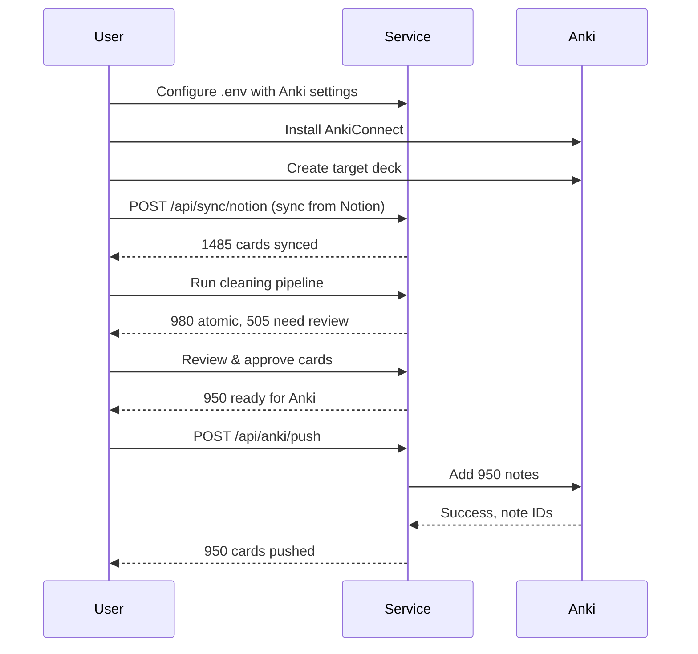
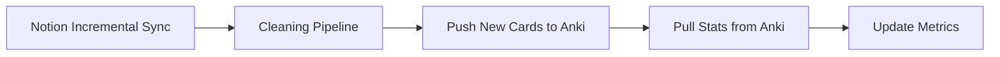

# Anki Integration Documentation

Complete guide to bidirectional synchronization between notion-learning-sync and Anki.

## Overview

The Anki integration provides **bidirectional sync**:

```
┌──────────────────────────────────┐
│  notion-learning-sync            │
│                                  │
│  ┌────────────────────┐          │
│  │  learning_atoms    │          │
│  │  (canonical data)  │          │
│  └─────────┬──────────┘          │
│            │                     │
│            ↓ PUSH (notes)        │
│    ┌───────────────────┐         │
│    │  AnkiConnect API  │←─────┐  │
│    └───────────────────┘      │  │
│            ↑                  │  │
│            │ PULL (stats)     │  │
│            ↓                  │  │
│  ┌────────────────────┐       │  │
│  │  Update atoms      │       │  │
│  │  with review stats │       │  │
│  └────────────────────┘       │  │
└──────────────────────────────────┘
                                 │
                                 ↓
                        ┌─────────────────┐
                        │  Anki Desktop   │
                        │  + AnkiConnect  │
                        └─────────────────┘
```

**Push direction** (Service → Anki):
- Clean, atomic flashcards
- Metadata (concept, module)
- Quality indicators

**Pull direction** (Anki → Service):
- Review statistics (ease, interval, lapses)
- Due dates
- Review history

This enables:
1. **Study in Anki** - Mature, proven SRS algorithm
2. **Track progress** - Centralized analytics in the service
3. **Adaptive content** - Identify difficult cards for improvement
4. **FSRS metrics** - Compute stability and retrievability

---

## Prerequisites

### 1. Install Anki

Download from [Anki's website](https://apps.ankiweb.net/):
- Windows, Mac, Linux support
- Free and open-source
- Version 2.1.54 or later recommended

### 2. Install AnkiConnect Plugin

1. Open Anki
2. Go to **Tools → Add-ons**
3. Click **Get Add-ons...**
4. Enter code: `2055492159`
5. Click **OK**
6. Restart Anki

**Verify installation**:
```bash
curl http://127.0.0.1:8765 -X POST -d '{"action":"version","version":6}'
```

Expected response:
```json
{"result": 6, "error": null}
```

### 3. Configure AnkiConnect

By default, AnkiConnect runs on `http://127.0.0.1:8765`.

**Custom configuration** (optional):

Create/edit `%APPDATA%\Anki2\addons21\2055492159\config.json`:

```json
{
    "apiKey": null,
    "apiLogPath": null,
    "webBindAddress": "127.0.0.1",
    "webBindPort": 8765,
    "webCorsOriginList": [
        "http://localhost"
    ]
}
```

**Security note**: AnkiConnect has no authentication by default. Only allow localhost connections unless you know what you're doing.

### 4. Deck Structure

The sync script automatically creates the CCNA deck hierarchy:

```
CCNA
└── ITN (Introduction to Networks)
    ├── M01 Networking Today
    ├── M02 Basic Switch and End Device Configuration
    ├── M03 Protocols and Models
    ├── M04 Physical Layer
    ├── M05 Number Systems
    ├── M06 Data Link Layer
    ├── M07 Ethernet Switching
    ├── M08 Network Layer
    ├── M09 Address Resolution
    ├── M10 Basic Router Configuration
    ├── M11 IPv4 Addressing
    ├── M12 IPv6 Addressing
    ├── M13 ICMP
    ├── M14 Transport Layer
    ├── M15 Application Layer
    ├── M16 Network Security Fundamentals
    └── M17 Build a Small Network
```

**Deck naming convention**: `CCNA::ITN::M{XX} {Module Name}`

**Nested decks**:
- Use `::` for hierarchy: `Parent::Child::Grandchild`
- Service creates decks automatically if they don't exist

---

## Configuration

Set these in your `.env` file:

```bash
# AnkiConnect URL
ANKI_CONNECT_URL=http://127.0.0.1:8765

# Target deck (will be created if doesn't exist)
ANKI_DECK_NAME=LearningOS::Synced

# Note type for new cards
ANKI_NOTE_TYPE=Basic
```

**Note types**:
- `Basic` - Front/Back (recommended)
- `Basic (and reversed card)` - Creates 2 cards
- `Cloze` - Cloze deletion (future support)
- Custom types - Must exist in Anki first

---

## Push: Service → Anki

Sending clean flashcards to Anki.

### What Gets Pushed

Only atoms that meet ALL criteria:
1. `atom_type IN ('flashcard', 'cloze')` - Only these types sync to Anki
2. `quality_score >= 0.75` - Grade B or better
3. `front IS NOT NULL AND front != ''` - Has content
4. `LENGTH(front) >= 10` - Minimum front length
5. `LENGTH(back) >= 3` - Minimum back length

**Atom Type Distribution**:
- **To Anki**: flashcard, cloze (FSRS scheduling)
- **In NLS**: mcq, true_false, matching, parsons (CLI quizzes)

**Filtering in query**:
```sql
SELECT *
FROM learning_atoms
WHERE atom_type IN ('flashcard', 'cloze')
  AND quality_score >= 0.75
  AND front IS NOT NULL
  AND LENGTH(front) >= 10
  AND LENGTH(back) >= 3
ORDER BY module_id, card_id;
```

### Push Algorithm

The sync script (`scripts/anki_full_sync.py`) handles pushing atoms to Anki:

```python
# Key functions in anki_full_sync.py:

def get_module_deck_name(module_num: int) -> str:
    """Get the deck name for a module number."""
    name = CCNA_ITN_MODULE_NAMES.get(module_num, f"Module {module_num}")
    return f"CCNA::ITN::M{module_num:02d} {name}"

def push_atoms_to_anki(dry_run: bool = False):
    """
    Push flashcard and cloze atoms TO Anki.

    ONLY these types go to Anki:
    - flashcard
    - cloze

    MCQ, true_false, matching, parsons stay in NLS for in-app quizzes.
    """
    # 1. Query learning_atoms for flashcard/cloze types with quality filters
    # 2. Create module-based decks (CCNA::ITN::M{XX} {Name})
    # 3. Build notes with 6-field structure
    # 4. Add/update notes via AnkiConnect
```

**Note Type**: `LearningOS-v2` (flashcards), `LearningOS-v2 Cloze` (cloze)

**6-Field Structure**:
| Field | Source |
|-------|--------|
| `concept_id` | `learning_atoms.concept_id` |
| `front` | `learning_atoms.front` |
| `back` | `learning_atoms.back` |
| `tags` | Auto-generated (curriculum, module, type) |
| `source` | `learning_atoms.source` |
| `metadata_json` | JSON blob with quality, difficulty, etc. |

### Push API Example

```bash
# Push all unpushed cards
curl -X POST http://localhost:8100/api/anki/push

# Push cards for specific concept
curl -X POST http://localhost:8100/api/anki/push \
  -H "Content-Type: application/json" \
  -d '{
    "filters": {
      "concept_id": "abc-123-def-456"
    }
  }'

# Push to custom deck
curl -X POST http://localhost:8100/api/anki/push \
  -H "Content-Type: application/json" \
  -d '{
    "deck_name": "Computer Science::Networks"
  }'

# Update existing notes
curl -X POST http://localhost:8100/api/anki/push \
  -H "Content-Type: application/json" \
  -d '{
    "overwrite_existing": true
  }'
```

### Push Result

```json
{
  "pushed": 125,
  "updated": 0,
  "skipped": 15,
  "errors": [],
  "details": {
    "total_candidates": 140,
    "already_in_anki": 15,
    "new_notes": 125,
    "deck": "LearningOS::Synced"
  }
}
```

---

## Pull: Anki → Service

Fetching review statistics from Anki.

### What Gets Pulled

For each card in Anki (where `anki_note_id IS NOT NULL`):

| Anki Field | Database Column | Description |
|------------|----------------|-------------|
| `factor` | `anki_ease_factor` | Ease factor (e.g., 2500 → 2.500) |
| `interval` | `anki_interval_days` | Current interval in days |
| `reviews` | `anki_review_count` | Total reviews |
| `lapses` | `anki_lapses` | Times forgotten |
| `due` | `anki_due_date` | Next review date |
| `lastReview` | `anki_last_review` | Last review timestamp |

### Pull Algorithm

```python
async def pull_stats_from_anki() -> PullResult:
    """
    Pull review statistics from Anki and update learning_atoms.

    Returns:
        PullResult with counts and summary stats
    """
    # 1. Get atoms synced to Anki
    atoms = db.query(LearningAtom).filter(
        LearningAtom.anki_note_id.isnot(None)
    ).all()

    if not atoms:
        return PullResult(updated=0, errors=[])

    # 2. Get card IDs
    card_ids = [atom.anki_card_id for atom in atoms if atom.anki_card_id]

    # 3. Fetch card info from Anki
    cards_info = await anki_client.cards_info(card_ids)

    # 4. Update atoms
    updated = 0
    errors = []

    for atom, info in zip(atoms, cards_info):
        if info is None:
            errors.append({
                "card_id": atom.card_id,
                "error": "Card not found in Anki"
            })
            continue

        try:
            # Update stats
            atom.anki_ease_factor = Decimal(str(info.get("factor", 0) / 1000.0))
            atom.anki_interval_days = info.get("interval", 0)
            atom.anki_review_count = info.get("reviews", 0)
            atom.anki_lapses = info.get("lapses", 0)

            # Convert due date (days since epoch)
            if info.get("due"):
                epoch = datetime(1970, 1, 1)
                atom.anki_due_date = epoch + timedelta(days=info["due"])

            # Last review timestamp
            if info.get("lastReview"):
                atom.anki_last_review = datetime.fromtimestamp(
                    info["lastReview"] / 1000.0
                )

            # Compute FSRS metrics
            if atom.anki_review_count > 0:
                atom.stability_days = compute_stability(info)
                atom.retrievability = compute_retrievability(info)

            updated += 1

        except Exception as e:
            errors.append({
                "card_id": atom.card_id,
                "error": str(e)
            })

    db.commit()

    # 5. Compute summary stats
    summary = {
        "avg_ease_factor": db.query(func.avg(LearningAtom.anki_ease_factor)).scalar(),
        "avg_interval_days": db.query(func.avg(LearningAtom.anki_interval_days)).scalar(),
        "total_reviews": db.query(func.sum(LearningAtom.anki_review_count)).scalar(),
        "total_lapses": db.query(func.sum(LearningAtom.anki_lapses)).scalar(),
    }

    return PullResult(
        updated=updated,
        errors=errors,
        summary=summary
    )
```

### Pull API Example

```bash
# Pull stats for all synced cards
curl -X POST http://localhost:8100/api/anki/pull-stats
```

### Pull Result

```json
{
  "updated": 980,
  "errors": [],
  "summary": {
    "avg_ease_factor": 2.35,
    "avg_interval_days": 45.2,
    "total_reviews": 15420,
    "total_lapses": 234
  }
}
```

---

## FSRS Metrics

[Free Spaced Repetition Scheduler](https://github.com/open-spaced-repetition/fsrs4anki) metrics for advanced analytics.

### Stability (S)

**Definition**: Predicted number of days until retrievability drops to 90%.

**Computation**:
```python
def compute_stability(card_info: dict) -> Decimal:
    """
    Compute memory stability from Anki review data.

    Uses a simplified FSRS formula.
    Returns stability in days.
    """
    interval = card_info.get("interval", 0)
    ease = card_info.get("factor", 2500) / 1000.0
    reviews = card_info.get("reviews", 0)
    lapses = card_info.get("lapses", 0)

    if reviews == 0:
        return Decimal("0")

    # Simplified FSRS: S = interval * ease * (1 - lapse_rate)
    lapse_rate = lapses / reviews if reviews > 0 else 0
    stability = interval * ease * (1 - lapse_rate)

    return Decimal(str(round(stability, 2)))
```

**Interpretation**:
- **High stability** (>100 days): Well-learned, mature card
- **Medium stability** (10-100 days): Consolidating
- **Low stability** (<10 days): Still learning

### Retrievability (R)

**Definition**: Probability of successful recall right now (0-1 scale).

**Computation**:
```python
def compute_retrievability(card_info: dict) -> Decimal:
    """
    Compute current retrievability (recall probability).

    Uses exponential forgetting curve.
    Returns value 0.0-1.0.
    """
    interval = card_info.get("interval", 0)
    due = card_info.get("due", 0)  # Days since epoch

    if interval == 0:
        return Decimal("0.5")  # New card

    # Days since last review
    today = (datetime.utcnow() - datetime(1970, 1, 1)).days
    days_since_review = today - (due - interval)

    # Exponential forgetting: R = 0.9 ^ (t / S)
    # Where t = days since review, S = stability
    stability = compute_stability(card_info)

    if stability == 0:
        return Decimal("0.5")

    retrievability = 0.9 ** (days_since_review / float(stability))

    return Decimal(str(round(retrievability, 4)))
```

**Interpretation**:
- **R > 0.9**: Easy recall, consider increasing interval
- **R = 0.5-0.9**: Optimal review window
- **R < 0.5**: Overdue, high risk of forgetting

### Using FSRS Metrics

```sql
-- Cards with low retrievability (needs review)
SELECT
    card_id,
    front,
    retrievability,
    anki_due_date,
    stability_days
FROM learning_atoms
WHERE retrievability < 0.5
  AND anki_note_id IS NOT NULL
ORDER BY retrievability ASC
LIMIT 50;

-- Cards with high stability (well-learned)
SELECT
    c.name as concept_name,
    COUNT(*) as mature_cards,
    AVG(a.stability_days) as avg_stability
FROM learning_atoms a
JOIN concepts c ON a.concept_id = c.id
WHERE a.stability_days > 100
GROUP BY c.name
ORDER BY avg_stability DESC;

-- Difficulty analysis (low ease = hard cards)
SELECT
    CASE
        WHEN anki_ease_factor < 2.0 THEN 'Hard'
        WHEN anki_ease_factor < 2.5 THEN 'Medium'
        ELSE 'Easy'
    END as difficulty,
    COUNT(*) as count,
    AVG(anki_lapses) as avg_lapses
FROM learning_atoms
WHERE anki_note_id IS NOT NULL
GROUP BY difficulty;
```

---

## Syncing Workflow

### Initial Setup



### Regular Sync Cycle

Recommended: Run daily



**Cron job** (Linux/Mac):
```bash
# Daily at 2 AM
0 2 * * * curl -X POST http://localhost:8100/api/sync/notion/incremental && \
          curl -X POST http://localhost:8100/api/anki/push && \
          curl -X POST http://localhost:8100/api/anki/pull-stats
```

**Windows Task Scheduler**:
```powershell
# Create scheduled task
$action = New-ScheduledTaskAction -Execute "curl" -Argument "-X POST http://localhost:8100/api/sync/notion/incremental"
$trigger = New-ScheduledTaskTrigger -Daily -At "2:00AM"
Register-ScheduledTask -TaskName "NotionLearningSync" -Action $action -Trigger $trigger
```

---

## Advanced Features

### Selective Sync by Concept

Only push cards for specific concepts:

```python
# Push only networking cards
await push_to_anki(
    filters={"concept_id": "networking-concept-uuid"}
)

# Or via tags
await push_to_anki(
    filters={"tags": ["Computer_Networks"]}
)
```

### Deck Mapping by Module

CCNA ITN modules use a hardcoded mapping for consistent deck names:

```python
CCNA_ITN_MODULE_NAMES = {
    1: "Networking Today",
    2: "Basic Switch and End Device Configuration",
    3: "Protocols and Models",
    4: "Physical Layer",
    5: "Number Systems",
    6: "Data Link Layer",
    7: "Ethernet Switching",
    8: "Network Layer",
    9: "Address Resolution",
    10: "Basic Router Configuration",
    11: "IPv4 Addressing",
    12: "IPv6 Addressing",
    13: "ICMP",
    14: "Transport Layer",
    15: "Application Layer",
    16: "Network Security Fundamentals",
    17: "Build a Small Network",
}

def get_module_deck_name(module_num: int) -> str:
    """Get the deck name for a module number."""
    name = CCNA_ITN_MODULE_NAMES.get(module_num, f"Module {module_num}")
    return f"CCNA::ITN::M{module_num:02d} {name}"
```

### Custom Tags

Add metadata as Anki tags:

```python
def generate_tags(atom: Atom) -> list[str]:
    """Generate tags for an atom."""
    tags = []

    # Concept hierarchy
    if atom.concept:
        if atom.concept.cluster:
            tags.append(atom.concept.cluster.name.replace(" ", "_"))
        if atom.concept.cluster and atom.concept.cluster.concept_area:
            tags.append(atom.concept.cluster.concept_area.name.replace(" ", "_"))
        tags.append(atom.concept.name.replace(" ", "_"))

    # Quality indicators
    if atom.quality_score >= 0.9:
        tags.append("high_quality")
    if atom.atomicity_status == "atomic":
        tags.append("atomic")

    # Difficulty prediction
    if atom.back_word_count > 10:
        tags.append("verbose_answer")

    return tags
```

### Handling Suspended Cards

Detect and handle suspended cards in Anki:

```python
async def sync_suspension_status():
    """Sync card suspension status from Anki."""
    atoms = db.query(LearningAtom).filter(
        LearningAtom.anki_card_id.isnot(None)
    ).all()

    card_ids = [atom.anki_card_id for atom in atoms]
    suspended = await anki_client.are_cards_suspended(card_ids)

    for atom, is_suspended in zip(atoms, suspended):
        atom.anki_is_suspended = is_suspended

    db.commit()
```

---

## Troubleshooting

### AnkiConnect not responding

**Error**:
```
ConnectionError: Failed to connect to Anki
```

**Solutions**:
1. Ensure Anki is running
2. Verify AnkiConnect is installed: **Tools → Add-ons**
3. Test manually: `curl http://127.0.0.1:8765 -X POST -d '{"action":"version","version":6}'`
4. Check firewall isn't blocking port 8765

### Duplicate cards created

**Problem**: Same card appears multiple times in Anki

**Causes**:
1. `anki_note_id` not saved properly
2. Multiple pushes without checking existing

**Prevention**:
```python
# Always check before pushing
if not overwrite_existing:
    query = query.filter(LearningAtom.anki_note_id.is_(None))

# Use Anki's duplicate prevention
note["options"] = {
    "allowDuplicate": False,
    "duplicateScope": "deck"
}
```

### Stats not updating

**Problem**: `anki_ease_factor` always NULL

**Checks**:
1. Have you reviewed cards in Anki? (New cards have no stats)
2. Is `anki_card_id` populated?
3. Check Anki API response: `cardsInfo([card_id])`

### Different ease factors in Anki vs database

**Cause**: Anki stores ease as integer (e.g., 2500), we store as decimal (2.500)

**Conversion**:
```python
# Anki → Database
ease_decimal = anki_factor / 1000.0

# Database → Anki
anki_factor = int(ease_decimal * 1000)
```

---

## Performance Considerations

### Batch Sizes

Recommended batch sizes for API calls:

| Operation | Batch Size | Rationale |
|-----------|-----------|-----------|
| Add notes | 100 | AnkiConnect limit |
| Get card info | 500 | Fast read operation |
| Update notes | 100 | Write operation |

**Implementation**:
```python
def chunks(lst, n):
    """Yield successive n-sized chunks from lst."""
    for i in range(0, len(lst), n):
        yield lst[i:i + n]

# Push in batches
for batch in chunks(atoms, 100):
    await push_batch_to_anki(batch)
```

### Sync Frequency

Recommendations based on usage:

| Scenario | Notion Sync | Anki Push | Anki Pull |
|----------|-------------|-----------|-----------|
| Active learning | Hourly | Daily | After each session |
| Maintenance | Daily | Weekly | Weekly |
| Archive | Weekly | Monthly | Monthly |

### Caching

Cache Anki deck list to avoid repeated queries:

```python
from functools import lru_cache
from datetime import datetime, timedelta

_deck_cache = {}
_cache_ttl = timedelta(minutes=5)

async def get_deck_names() -> list[str]:
    """Get Anki deck names with caching."""
    now = datetime.utcnow()

    if "decks" in _deck_cache:
        cached_time, decks = _deck_cache["decks"]
        if now - cached_time < _cache_ttl:
            return decks

    # Fetch from Anki
    decks = await anki_client.deck_names()
    _deck_cache["decks"] = (now, decks)

    return decks
```

---

## Analytics & Reporting

### Sync Status Dashboard

```sql
-- Overall sync status
SELECT
    COUNT(*) as total_atoms,
    COUNT(*) FILTER (WHERE anki_note_id IS NOT NULL) as in_anki,
    COUNT(*) FILTER (WHERE atom_type IN ('flashcard', 'cloze') AND anki_note_id IS NULL) as ready_to_push,
    COUNT(*) FILTER (WHERE atom_type NOT IN ('flashcard', 'cloze')) as nls_only
FROM learning_atoms;

-- Concept coverage in Anki
SELECT
    c.name as concept,
    COUNT(a.id) as total_cards,
    COUNT(a.id) FILTER (WHERE a.anki_note_id IS NOT NULL) as in_anki,
    ROUND(
        100.0 * COUNT(a.id) FILTER (WHERE a.anki_note_id IS NOT NULL) / COUNT(a.id),
        1
    ) as coverage_percent
FROM concepts c
LEFT JOIN learning_atoms a ON a.concept_id = c.id
GROUP BY c.name
ORDER BY coverage_percent ASC;
```

### Learning Progress

```sql
-- Mature cards by concept
SELECT
    c.name as concept,
    COUNT(*) FILTER (WHERE a.anki_interval >= 21) as mature_cards,
    COUNT(*) FILTER (WHERE a.anki_interval >= 100) as very_mature,
    AVG(a.anki_ease_factor) as avg_ease
FROM concepts c
JOIN learning_atoms a ON a.concept_id = c.id
WHERE a.anki_note_id IS NOT NULL
GROUP BY c.name
ORDER BY mature_cards DESC;

-- Difficult cards (low ease, high lapses)
SELECT
    card_id,
    front,
    anki_ease_factor,
    anki_lapses,
    anki_review_count,
    ROUND(100.0 * anki_lapses / NULLIF(anki_review_count, 0), 1) as lapse_rate
FROM learning_atoms
WHERE anki_note_id IS NOT NULL
  AND anki_review_count >= 5
ORDER BY lapse_rate DESC
LIMIT 20;
```

---

## Future Enhancements

### Planned Features

1. **Image support**: Sync images to Anki media folder
2. **Audio clips**: TTS integration for pronunciation
3. **Cloze deletions**: Auto-convert list answers to cloze cards
4. **Custom note types**: Field mapping for complex cards
5. **Anki mobile sync**: Direct sync without desktop

### Research Areas

1. **Optimal scheduling**: Adjust Anki settings based on FSRS data
2. **Difficulty prediction**: ML model to predict card ease
3. **Personalized thresholds**: Adapt atomicity rules per-user
4. **Retention curves**: Track long-term retention by concept

---

## References

- [AnkiConnect Documentation](https://foosoft.net/projects/anki-connect/)
- [Anki Manual](https://docs.ankiweb.net/)
- [FSRS Algorithm](https://github.com/open-spaced-repetition/fsrs4anki)
- [Anki API Protocol](https://foosoft.net/projects/anki-connect/index.html#supported-actions)
- [Spaced Repetition Research](https://www.gwern.net/Spaced-repetition)

---

## Support

For issues:
1. Check Anki logs: **Help → About → Copy Debug Info**
2. Check service logs: `logs/notion_learning_sync.log`
3. Test AnkiConnect manually with curl
4. See [Quickstart Guide](quickstart.md) for setup help
